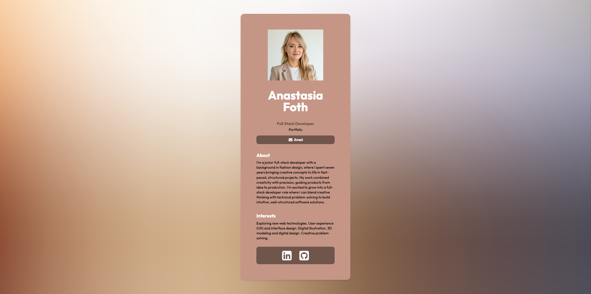

# Digital Business Card

## 📸 Screenshot



A small React + Vite project that renders a personal digital business card for me. It demonstrates a simple component structure, uses Vite for tooling, and includes basic ESLint configuration.

**Highlights**

- **Profile card** with name, role, portfolio link and an email button.
- Small component-based layout: `Info`, `About`, `Interests`, `Footer`.
- Built with React and Vite for fast dev iteration.

**Tech Stack**

- React 19
- Vite
- ESLint (basic config)

**Quick Links**

- File: [README.md](README.md#L1)
- Entry: [src/main.jsx](src/main.jsx#L1)
- App component: [src/App.jsx](src/App.jsx#L1)
- Profile content: [src/components/Info.jsx](src/components/Info.jsx#L1)

**Project structure (important files)**

- `index.html`: app container and metadata
- `src/main.jsx`: React entry and root render
- `src/App.jsx`: page layout and component composition
- `src/components/Info.jsx`: profile image, name, role, portfolio link, and email button
- `src/components/About.jsx`, `src/components/Interests.jsx`, `src/components/Footer.jsx`: page sections
- `src/img/profile_pic.jpeg`: profile image used by the card

## Run locally

Install dependencies and start the dev server:

```bash
npm install
npm run dev
```

Build for production:

```bash
npm run build
npm run preview
```

Lint the project:

```bash
npm run lint
```

## Editing content

- Update personal details (name, title, portfolio link, email) in [src/components/Info.jsx](src/components/Info.jsx#L1).
- Swap the profile image at `src/img/profile_pic.jpeg`.

## Notes and next steps

- This is a minimal demo; feel free to add responsive styles, tests, or a small contact form.

If you want, I can (a) add a more detailed contribution/dev guide, (b) wire up a contact form, or (c) run the dev server and verify the app locally — tell me which.
